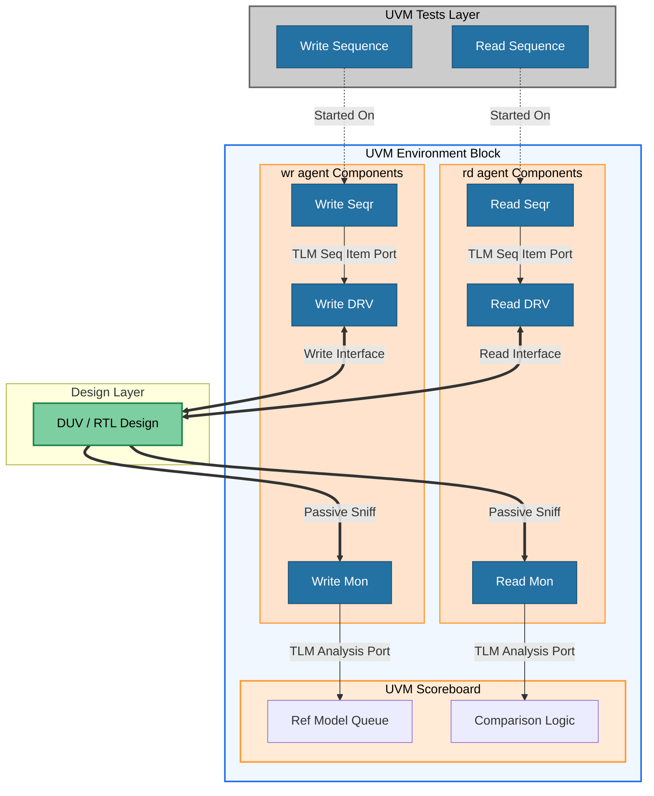

# Multi-Channel DMA Controller UVM Verification Environment

## 📌 Project Overview
This repository contains a production-grade Universal Verification Methodology (UVM) testbench environment designed to verify a multi-channel Direct Memory Access (DMA) controller IP. The environment comprehensively validates concurrent data transfers, priority arbitration, and strict compliance with standard bus protocols.

## 🛠️ Key Features & Protocols
* **Configuration Interface:** AMBA AXI4-Lite (Slave) for register programming.
* **Data Transfer Interface:** AMBA AXI4 (Master) for high-speed burst memory transactions.
* **Channels Supported:** 4 independent channels with programmable priority logic.
* **Verification Methodologies:** SystemVerilog, UVM 1.2, SystemVerilog Assertions (SVA), and constrained-random stimulus generation.

## 🏗️ Verification Architecture
The testbench is built using a highly modular, reusable Universal Verification Methodology (UVM) structure as illustrated below:

## 📋 Verification Plan (VPlan)

To ensure 100% functional coverage and protocol compliance, the verification strategy maps out specific validation milestones:

### 1. Register & Configuration Interface (AXI4-Lite)
| Feature to Verify | Stimulus Mechanism | Expected Output / Checking | Status |
| :--- | :--- | :--- | :--- |
| Register Write/Read Access | Constrained Random Sequences | Scoreboard prints exact match of addresses, lengths, and start bits. | ✅ Passed |
| Back-to-Back Access | High-density configuration writes | Register file handles configuration without dropping transactions. | ✅ Passed |

### 2. Data Transfer & Protocol Compliance (AXI4-Full)
| Feature to Verify | Stimulus Mechanism | Expected Output / Checking | Status |
| :--- | :--- | :--- | :--- |
| Single Burst Transfer | `dma_base_test` configuration | 16-beat data streams match sequentially from source to destination. | ✅ Passed |
| Multi-Burst Split Transfers | Payloads > 16 words (`xfer_len` up to 256) | Master FSM splits transfers into independent 16-beat chunks seamlessly. | 🔄 Planned |
| Handshake Settlement Timing | Delta-cycle boundary simulation | No duplicate or stalled beats on high-speed transitions. | ✅ Passed |
| `WLAST` / `RLAST` Boundaries | End-of-burst alignment sequences | Master terminates bus phases exactly on the final handshake. | ✅ Passed |

### 3. Functional Coverage & Metrics (Planned)
* **SystemVerilog Assertions (SVA):** Checking interface boundary violations (e.g., `AWVALID` must not drop until `AWREADY` is asserted).
* **Cross-Coverage:** Cross-coverage metrics monitoring Channel IDs vs. Burst Lengths vs. Memory Ranges.
